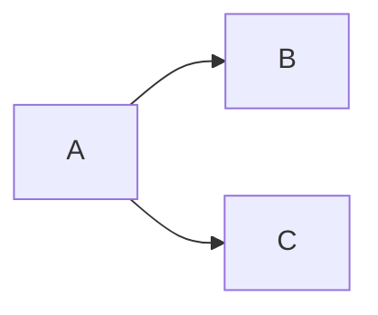
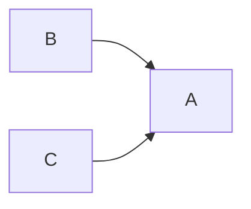

Afferent and Efferent coupling. Dependencies and how they map.

## Afferent

Number of people that couple to me
*coupling in*

## Efferent

The number of people I couple to
*coupling out*

## Example

**A** has an efferent coupling of 2 and **B** has a afferent coupling of 1

**B** and **C** have an efferent coupling of 1 and **A** has an afferent coupling of 2

