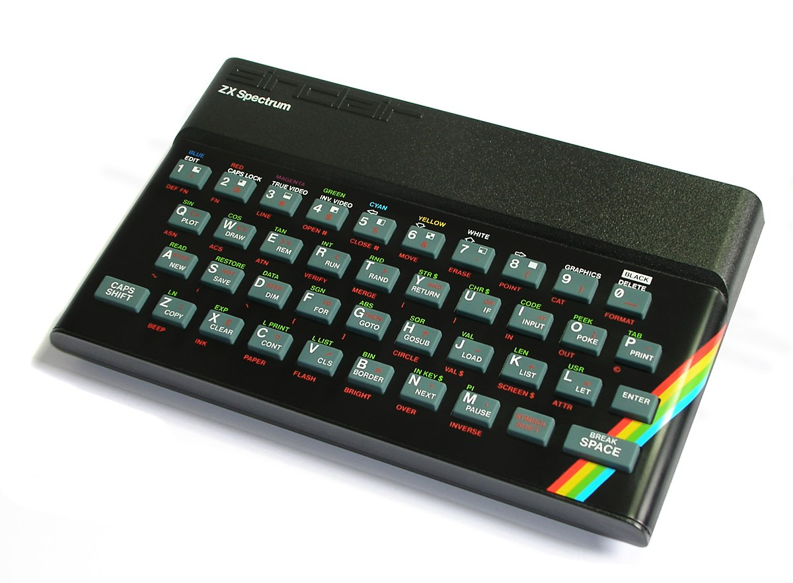
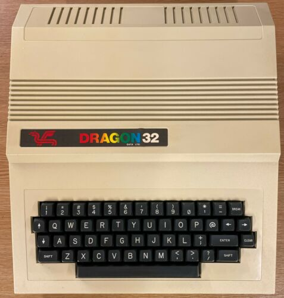
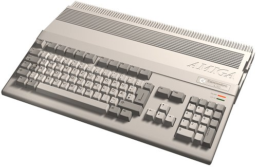
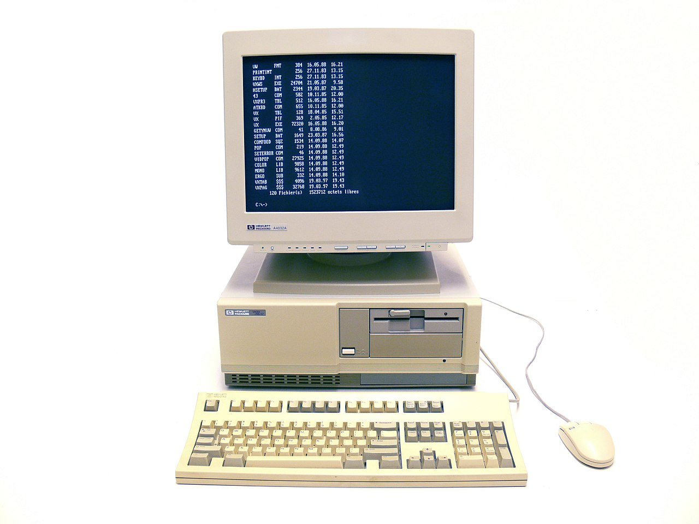
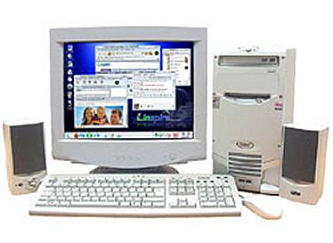
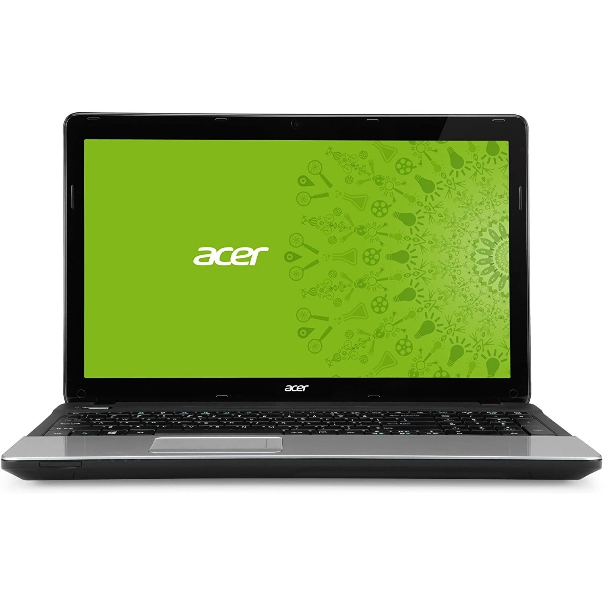
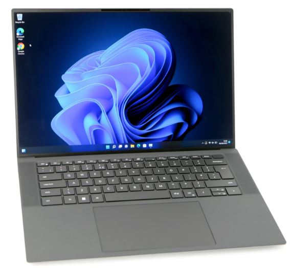
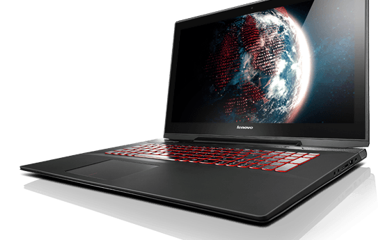

# Fun Stuff

Developers love to laugh about tech.

## Agile

[lafable framework](https://www.lafable.com/)

## My Computers through the years

### ZX Spectrum

I remember fondly of spending weekends with my father writing code we got from a magazine into the console only to find an error on line `:10,456` !!!!!!

### Dragon 32

A little known computer but this one had cassette tapes for loading the games! Upgrade!

### Commodore Amiga 512

THe famed Amiga!! I was so surprised to get this one Christmass as thought I was only getting a Commadore 64!

### HP Precision

### 486 by Tiny Computers

### Acer Laptop

Was a good little laptop in its day.

### Dell Precision Desktop

### Lenovo Y70 Laptop

Latest laptop bought as a contractor and now mainly used by my son. I mainly use work laptops now.

